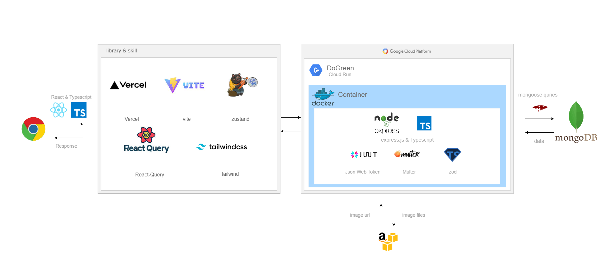

<hr />

# DO GREEN 🌏🌱


<br>
<h3>✅ 서비스 소개</h3>환경 뉴스레터 구독 서비스  
<h3>✅ 서비스 요약</h3>기후 위기, 멸종위기 동물, 환경 문제 등에 대하여 구독제 서비스를 통해 뉴스레터를 지속적으로 받아 볼 수 있는 웹서비스
<h3>✅ 시연영상 </h3>
👉 https://drive.google.com/file/d/1dx1qJLW1PRYh1PGS8zEtaRXNGfaSPQ0L/view?usp=sharing
<br>
<br>

## 1. TECH STACK

<br>


<div align="center">
<h3>🛠 FrontEnd 🛠</h3>


<br>


<br>
<br>
<p>Zustand를 이용한 전역 상태 관리로 불필요한 리렌더링 방지, 중복 코드 최소화</p>
<p>React Query로 캐싱 처리, 최소한의 요청 처리, 성능 최적화</p>
<p>Axios instance 사용을 통한 중복 코드 최소화</p>
<p>뉴스페이지와 댓글 기능에 react-query useInfiniteQuery를 이용한 Infinite scroll 구현</p>
<p>좋아요 기능에 react-query을 이용한 optimistic update 구현</p>
<p>alert/confirm 등 용도 변경 가능한 dialog modal 구현</p>
<p>skeleton screen 적용</p>
<p>Component화를 통한 재사용성, 중복 방지에 대한 고민</p>
<p>SPA를 통한 불필요한 리렌더링 제거, 사용자 경험 고려</p>
<p>Vite로 안정되고 신속한 빌드 처리</p>
<p>TypeScript 사용을 통한 잠재적 에러발생 감소와 생산성 높은 코드 작성</p>
<p>Tailwind CSS를 이용한 Dark mode 구현 및 가독성을 높이기 위한 스타일 클래스 및 컴포넌트화</p>
</p>
<p></p>

</div>


<br>
<br>

<div align="center">
<h3>🛠 BackEnd 🛠</h3>


<br>


<br>
<br>
<p>Layered Architecture를 사용하여 도메인 로직을 분리</p>
<p>Dockerfile과 GCP를 사용한 CI/CD 자동화</p>
<p>MongoDB Atlas를 사용하여 애플리케이션과 데이터베이스 분리
페이지네이션으로 올 쿼리 요청 최적화</p>
<p>Zod library로 request validation을 통한 데이터 2차 검증</p>
<p>TypeScript의 Pick, Omit, Union 타입을 이용하여 재사용성 극대화</p>
<p>tiny-invariant 외부 라이브러리를 커스텀하여 type guard 해주는 유틸 함수 구현</p>
<p>Express의 request 타입을 확장하여 미들웨어에서 공유 가능한 context 생성</p>
<p>S3 bucket으로 이미지 파일 저장소 분리</p>
</div>

## 2. ABOUT SERVICE

<details><summary>메인페이지</summary>

- Autoplay Carousel<br>    
- Infinite Autoplay Carousel<br>  
- 페이지 최상단 이동 버튼 구현<br>  
- 카테고리 목록 조회
</details>

<details><summary>Dark mode / Skeleton Screen</summary>

- Tailwind CSS를 이용한 Darkmode 구현
- UX 개선을 위한 Skeleton screen 
</details>

<details><summary>로그인</summary>


- react-hook-form과 yup을 이용한 validation<br> 
- 모달 창을 이용하여 페이지 이동없이 로그인 가능<br> 
- 로그인하는 경로에 따라, 로그인 이후의 경로 이동<br>
- 모달알람 창을 통하여 로그인 오류 및 로그아웃 확인<br>
</details>

<details><summary>회원가입 </summary>

- react-hook-form과 yup을 이용한 validation<br>
- 서버내 동일한 이름과 이메일이 존재하는지, 값을 입력하며 validation<br>
</details>

<details><summary>내 정보 수정</summary>

- react-hook-form과 yup을 이용한 validation<br>
- 현재 비밀번호를 필수로 입력한 뒤, 원하는 정보만 선택하여 수정 가능<br>
- 서버내 동일한 이름이 존재하는지, 값을 입력하며 validation<br>
- 모달, 알람 창을 통하여 제출 확인 선택과 에러 상태 확인 가능<br>
- 모달을 통하여 페이지 이동없이 회원탈퇴 가능<br>
</details>

<details><summary>카테고리 페이지</summary>

- 카드 Hover Flip 애니메이션<br>  
- 구독완료/취소 react toast 알림<br>  
- 로그인/유저 여부에 따른 구독 상태변화<br>  
- 모달, 알림창 공통 컴포넌트/ 훅 관리<br>  
- 카테고리 목록 조회<br>  
- 구독하기, 구독 목록 조회<br>  
</details>

<details><summary>뉴스레터 페이지</summary>


- react-query useInfiniteQuery를 이용한 뉴스레터와 댓글에서의 Infinite scroll 구현
- react-query를 이용한 좋아요 기능 Optimistic update 구현
- 작성자와 유저가 일치할 경우 댓글 삭제 가능
- 로그아웃 유저의 좋아요/댓글 기능 이용 
</details>

<details><summary>마이페이지</summary>

- Progress bar CSS 적용<br>  
- React heatmap calender CSS 적용<br>  
- 반응형 네비게이션바 구현<br>  
- 유저 정보 조회, 수정, 삭제<br>   
- 구독 목록 조회, 구독 취소<br>  
</details>

<details><summary>관리자 페이지</summary>
</details>
<br>

## 3. ARCHITECTURE

- 서비스 구조도 그림 
- ERD <br>
- 와이어프레임  
  <t>   
  <t>https://www.figma.com/file/tXtlbgXtKAsmPOo2scuaUn/team2-team-library?node-id=0%3A1&t=gwOCbP2MqN0caJlU-1

- API 명세 https://www.notion.so/b607690ea13744f3bc04a890a50a49ba?p=1a8eaa08dcc142d18cecd0b1b7387680&pm=s

## 4. 프로젝트 팀원 역할 분담

| 이름   | 포지션  | 담당업무                                                     |
| ------ | ------- | ------------------------------------------------------------ |
| 박지수 | 팀장/FE | 뉴스, 코멘트, 카테고리 구현 및 환경설정/라우팅               |
| 이예나 | FE      | 메인페이지, 카테고리, 마이페이지, 모달 구현                  |
| 이지현 | FE      | 로그인, 모달, 유저 관련 기능 구현                            |
| 지시안 | FE      | 어드민, 헤더/네비게이터/푸터 구현                            |
| 서윤지 | BE      | 유저, JWT, 구독 기능, 이미지 업로드, 배포, 에러처리 미들웨어 |
| 손형석 | BE      | 카테고리, 뉴스레터, 좋아요, 댓글 기능 구현                   |

## 5. 실행 방법

- BE
  ```
  1. docker 실행
  2. yarn dev
  ```
- FE
  ```
  1. npm i
  2. npm run dev
  ```

## 6. 버전

- 0.0.0

## 7. FAQ
